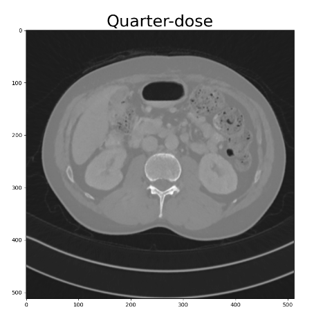
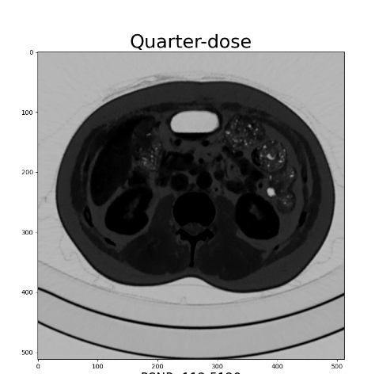

# CT_DIY
TODO

12.7：

cncl：

1. ~~loss~~
2. ~~training engine~~
   1. ~~logger(loguru)~~
   2. ~~yaml(omegaconf)~~

3. test engine

看

NAFNet

（借鉴的经典论文，Restomer还有啥，记不清了）

12.8:

ideas:

1. ~~dis: GAN / LSGAN（注意训练时可以考虑迭代多次生成器之后再迭代一次判别器，10 seems nice）~~
2. gen
   1. layernorm(换bn，加入)
   2. attn（content）
3. loss
   1. ~~pixelwise~~
   2. ~~texture loss (gram，需要**额外**encoder)~~
   3. ~~perceptual loss（需要**额外**encoder）~~
4. training schema
   1. interpolate training ($\alpha f + (1-\alpha)g$)
   2. 末尾激活函数对感知损失结果输出具有负面影响（https://zhuanlan.zhihu.com/p/73395512）
   3. kd,ema（教师）

cncl:

1. ~~继续写cncl的训练代码（ok）~~
2. ~~加入wandb/tensorboard(wandb复杂但好用，我选择tensorboard)~~

12.13:

but seriously, you need to change the **fusion model.**

在这里先调试一下输出的噪声分支，观察一下谁的输出更合理一些。

12.15

准备改fusion，先输出一下不同策略下面最终输出图像和真实图像的差值，观察差异在哪里

检测出貌似加了texture loss使得content分支没办法正常工作：

如果texture loss设置成为0.1那么就还好：

如果texture loss设置成为1那么content分支崩掉：

但是就psnr结果来说好像texture loss为1的时候反而更好，可能是噪声分支学习的已经很好了，fusion层一蹴而就

下面要做的事情：

1. 可能是因为原图大小只有64$\times $64，经过vgg卷积之后就只有4$\times$4的原因，texture loss根本没帮上什么忙，后期的重点工作并不包括texture loss以及其相关（比如perceptual loss，kd，ema），有空才尝试
2. ~~去掉激活函数改用Gated Linear Unit~~
3. fusion layer，去掉1$\times$1的conv，改用3$\times$3的conv（因为1 $\times$ 1看起来就是3$ \times$ 3的特例）
4. fusion layer，去掉1$\times$1的conv，改用transformer based methods（
   1. crossattn
   2. restormer

12.16 

今天写代码的时候才发现改fusion的思路不太对，因为fusion拿到的始终只有1 channel的噪声图和1 channel的内容图

所以fusion层也只能写成SimpleFusion了（悲

也正因为这样，我们可以挑选出noise的特征图和content的特征图，对**特征图**进行fusion，然后预测

在这里我们就可以讲故事：因为cncl_baseline的双分支其实始终是独立的，只有在最后simpleFusion处进行交互

所以我们要让他们提前的，或者更激进的是在整个推理过程中进行交互（motivation合理性得证desu）

所以就可以加上CrossAttn了